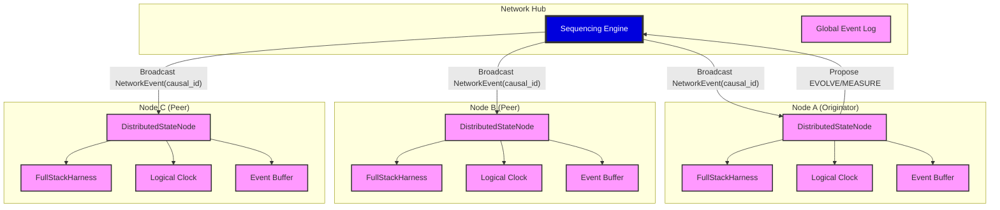

# Distributed Node Architecture Diagram

### Key Components
- **FullStackHarness**: The local quantum state and evolution engine (Cycles 1-8).
- **Sequencing Engine**: Assigns deterministic `causal_id` to proposed events.
- **Event Buffer**: Handles out-of-order network arrival to ensure sequential application.
- **Logical Clock**: Tracks the node's progress through the global causal timeline.
