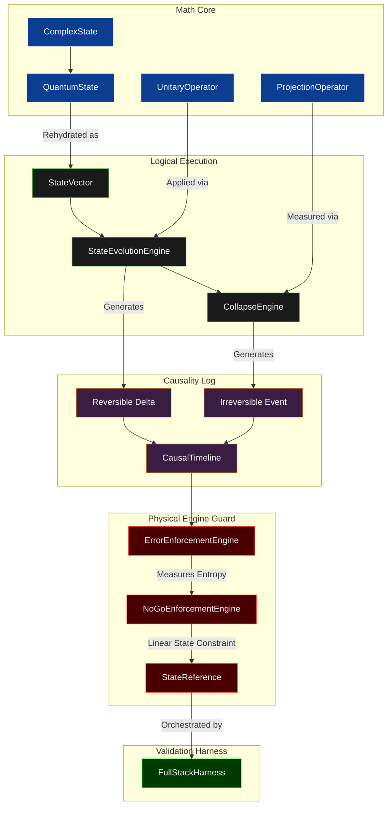

# Integration Architecture Diagram

```mermaid
graph TD
    %% Core Mathematics Layer (C6-8)
    subgraph Math Core
        CS[ComplexState] --> QS[QuantumState]
        O[UnitaryOperator]
        P[ProjectionOperator]
    end

    %% Logical State & Evolution Layer (C1-2)
    subgraph Logical Execution
        QS -- Rehydrated as --> SV[StateVector]
        SV --> SE[StateEvolutionEngine]
        SE --> CE[CollapseEngine]
        O -- Applied via --> SE
        P -- Measured via --> CE
    end

    %% Causality Layer (C3)
    subgraph Causality Log
        SE -- Generates --> RDelta[Reversible Delta]
        CE -- Generates --> IEvent[Irreversible Event]
        RDelta --> TL[CausalTimeline]
        IEvent --> TL
    end

    %% Enforcement & Physical Bounds (C4-5)
    subgraph Physical Engine Guard
        TL --> EEE[ErrorEnforcementEngine]
        EEE -- Measures Entropy --> NGE[NoGoEnforcementEngine]
        NGE -- Linear State Constraint --> Ref[StateReference]
    end

    %% Global Harness (Verification)
    subgraph Validation Harness
        Ref -- Orchestrated by --> FH[FullStackHarness]
    end

    classDef core fill:#0b3d91,stroke:#ffffff,color:#fff;
    classDef logic fill:#1a1a1a,stroke:#4caf50,color:#fff;
    classDef causal fill:#3a1d42,stroke:#ff9800,color:#fff;
    classDef bound fill:#4a0000,stroke:#f44336,color:#fff;
    classDef harness fill:#003c00,stroke:#00ff00,color:#fff;

    class CS,QS,O,P core;
    class SV,SE,CE logic;
    class RDelta,IEvent,TL causal;
    class EEE,NGE,Ref bound;
    class FH harness;
```
