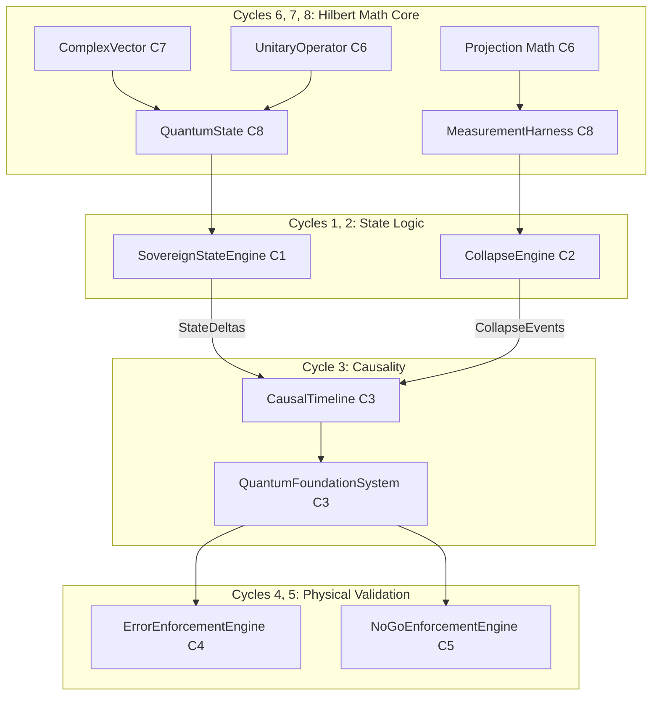

# System Integration Map

## Subsystems (Cycle 1–8)
- **Cycle 1 (State Evolution)**: `SovereignStateEngine` manages discrete evolution of the `StateVector`, emitting `StateDelta` logs. Enforces norm conservation and deterministic transitions.
- **Cycle 2 (Measurement)**: `CollapseEngine` evaluates `MeasurementPolicy` rules. Handles wavefunction collapse, emits `IrreversibleCollapseEvent`, and bounds information loss.
- **Cycle 3 (Causality)**: `CausalTimeline` provides global sequence ordering via `CausalEvent`. Built into `QuantumFoundationSystem` which wires Cycles 1, 2, and 3.
- **Cycle 4 (Error Enforcement)**: `ErrorEnforcementEngine` wraps executions to enforce physical disturbance, monotonic fidelity loss, and explicit `CORRECTION` constraints.
- **Cycle 5 (No-Go Enforcement)**: `NoGoEnforcementEngine` guards against unphysical operations (No-Cloning, No-Deleting) by strictly tracking `StateReference` integrity during evolution and collapse.
- **Cycle 6 (Formal Math Layer)**: `UnitaryOperator` and `ProjectionOperator` define fundamental geometric transformations and projective collapse mechanics.
- **Cycle 7 (Vector Space Layer)**: `ComplexVector` implements pure immutable linear $\mathbb{C}^N$ representations.
- **Cycle 8 (Hilbert Space Integration)**: `IntegrationChainHarness` unifies C6 and C7 into an airtight deterministic math pipeline (`QuantumState`, `UnitaryOperator`, `MeasurementHarness`).

## Integration Points & Interface Boundaries
1. **Math to Logic (C6-8 -> C1-2)**: The physical transitions generated by Cycle 6/7/8 mathematics (unitary applications and projective measurements) act as the deterministic transition rules and measurement updates modeled inside Cycle 1's `StateEngine` and Cycle 2's `CollapseEngine`.
2. **Logic to Causality (C1-2 -> C3)**: All discrete internal evolutions (`StateDelta`) and measurements (`IrreversibleCollapseEvent`) are subsequently recorded as immutable `CausalEvent` entries in the `CausalTimeline`.
3. **Execution to Physical Constraints (C3 -> C4/5)**: The execution engines and timelines are wrapped by the `ErrorEnforcementEngine` (injecting necessary thermodynamic noise and collapse entropy) and the `NoGoEnforcementEngine` (enforcing strict historical linearity without state cloning or branch tracking).

## Invariant Enforcement Points
- **Norm Preservation**: Mathematically enforced at the lowest base layer (C7 `ComplexVector`, C8 `QuantumState`) and logically enforced during engine transitions inside C1/C2 bounds.
- **Irreversibility**: Conceptually enforced via `PointOfNoReturn` boundaries in the causality layer (C3), validated mathematically via destructive entropy generation in measurement outcomes (C2/C4).
- **No-Cloning / Timeline Integrity**: Enforced strictly by tracking `StateReference` against the timeline sequence within C5.

## Integration Graph

